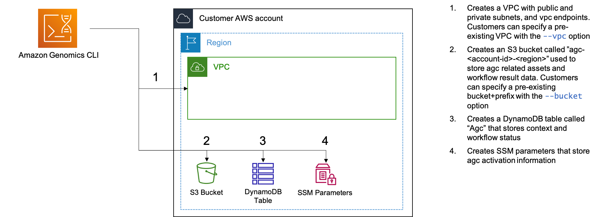

Amazon Genomics CLI requires an AWS account in which to deploy the cloud infrastructure required to run and manage workflows. To begin
working with Amazon Genomics CLI and account must be "Activated" by the Amazon Genomics CLI application using the [account activate]( ) command.

## Which AWS Account is Used by Amazon Genomics CLI?

Amazon Genomics CLI uses the same [AWS credential chain](https://docs.aws.amazon.com/cli/latest/userguide/cli-configure-quickstart.html#cli-configure-quickstart-precedence) 
used by the AWS CLI to determine what account should be used and with what credentials.
All that is required is that you have an existing AWS account (or create a new one) which contains at least one IAM Principal 
(User/ Role) that you have can access.

## Which Region is Used by Amazon Genomics CLI?

Much like accounts and credentials, Amazon Genomics CLI uses the same chain used by the AWS CLI to determine the region that is being targeted.
For example, if your AWS profile uses `us-east-1` then Amazon Genomics CLI will use the same. Likewise, if you set the `AWS_REGION` environment
variable to `eu-west-1` then that region will be used by Amazon Genomics CLI for all subsequent commands in that shell.

## Shared Infrastructure

When a region is first activated for Amazon Genomics CLI, some basic infrastructure is deployed including a 
[VPC](https://docs.aws.amazon.com/vpc/latest/userguide/index.html), which is used for the compute infrastructure that will be deployed in a [context](  ), 
and an [S3](https://docs.aws.amazon.com/AmazonS3/latest/userguide/index.html) bucket which will be used to store workflow intermediates and results. This
core infrastructure will be shared by all Amazon Genomics CLI users and projects in that region.

The following diagram shows the infrastructure deployed when the command `agc account activate` is run:



Note that context specific infrastructure is not shared and is unique and namespaced by user and project.

## Bring your Own VPC and S3 Bucket

During account [activation]( ) you may specify an existing VPC ID or S3 bucket name for use by Amazon Genomics CLI. If you do not these will 
be created for you. Although we use AWS best practices for these, if your organization has specific security requirements 
for networking and storage this may be the easiest way to activate Amazon Genomics CLI in your environment.

## Account Commands

A full reference of the account commands is [here](  )

### `activate`

You can activate an account using `agc account activate`. An account must be activated before any contexts can be deployed
or workflows run. 

Activating an account will also bootstrap the AWS Environment for CDK app deployments.

#### Using an Existing S3 Bucket

Amazon Genomics CLI requires an S3 bucket to store workflow results and associated information. If you prefer to use an existing bucket
you can use the form  `agc account activate --bucket my-existing-bucket`. If you do this the AWS [IAM](https://docs.aws.amazon.com/IAM/latest/UserGuide/index.html) role used to run
Amazon Genomics CLI must be able to write to that bucket.

#### Using an Existing VPC

To use an existing VPC you can use the form  `agc account activate --vpc my-existing-vpc-id`. This VPC must have at least
3 availability zones each with at least one private subnet. The private subnets must have connectivity to the internet, 
such as via a NAT gateway, and connectivity to AWS services either through VPC endpoints or the internet. Amazon Genomics CLI will not
modify the network topology of the specified VPC.

#### Specifying Subnets

When using an existing VPC you may need to specify which subnets of the VPC can be used for infrastructure. This is useful
when only some private subnets have internet routing. To do this you can supply a comma separated list of subnet IDs using
the `--subnets` flag, or repeat the flag multiple times. For example:

`agc account activate --vpc my-existing-vpc-id --subnets subnet-id-1,subnet-id-2 --subnets subnet-id-3`

We recommend a minimum of 3 subnets across availability zones to take advantage of EC2 instance availability and to
ensure high availability of infrastructure.

#### Using a Specific AMI for Compute Environments

Some organizations restrict the use of AMIs to a pre-approved list. By default, Amazon Genomics CLI uses the most recent
version of the Amazon Linux 2 ECS Optimized AMI. To change this behavior you can supply the ID of an alternative AMI at
account activation. This AMI will then be used for all compute environments used by all newly deployed contexts.

```shell
agc account activate --ami <ami-id>
```

There are some specific requirements that the AMI must comply with. It must be a private AMI from the same account that
you will use for deploying Amazon Genomics CLI infrastructure. It must also be capable of successfully running all parts
of the [LaunchTemplate](https://github.com/aws/amazon-genomics-cli/blob/main/packages/cdk/lib/constructs/launch-template-data.ts)
executed at startup time including the [ecs-additions](https://github.com/aws/amazon-genomics-cli/tree/main/packages/cdk/lib/artifacts/batch-artifacts/ecs-additions) 
dependencies. We recommend an ECS optimized image based on Amazon Linux 2, RHEL, Fedora or similar. 

If the LaunchTemplate cannot complete successfully it will result in an EC2 instance that cannot join a
compute-cluster and cannot complete workflow tasks. A common symptom of this is workflow tasks that become stuck in a "runnable"
state but are never assigned to a cluster node.  

#### Using Only Public Subnets

Amazon Genomics CLI can create a new VPC with only public subnets to use for its infrastructure using the `--usePublicSubnets` flag.

`agc account activate --usePublicSubnets`

This can reduce costs by removing the need for NAT Gateways and VPC Gateway Endpoints to route internet traffic from private subnets.
It can also reduce the number of Elastic IP Addresses consumed by your infrastructure.

{}
When using a VPC with only public subnets, you will need to ensure that the contexts defined in `agc-project.yaml` files declare that they
will use public subnets. For example:
{}

```yaml
contexts:
  myContext:
    usePublicSubnets: true
    engines:
      - type: nextflow
        engine: nextflow
```

{}
Currently, use of public subnets is only supported for contexts that use the Nextflow engine. Use of public IPs with the
Cromwell server creates a security risk and will fail. Assignment of public IPs to AWS Batch Fargate tasks (as used by miniwdl and SnakeMake)
is possible but will require changes to the WES adapters of those engines. If you need this please file a [feature request](https://github.com/aws/amazon-genomics-cli/issues/new?labels=enhancement) with your use case
{}

##### Security Considerations

Although your infrastructure will be protected by security groups you should be aware that any manual modification of these may result in exposing your
infrastructure to the internet. For this reason *we do **not** recommend using this configuration in production 
or with sensitive data*.

#### Updating
Issuing `account activate` commands more than once effectively updates the core infrastructure with the difference between
the two commands according to the rules below.

##### Updating the VPC

You may change the VPC used by issuing the command `agc account activate --vpc <vpc-id>`. If a `--vpc` argument is *not*
provided as part of an `agc account activate` command then the last VPC used will be 'remembered' and used by default.

If you wish to change to use a new default VPC created by Amazon Genomics CLI you must deactivate (`agc account deactivate`) 
and reactivate with no `--vpc` flag.

```shell
agc account activate               # VPC 1 created.
agc account activate --vpc-id abc  # VPC 1 destroyed and customer VPC abc used. 
agc account activate               # VPC 2 created. Customer VPC retained.
agc account deactivate             # AGC core infrastructure destroyed. Customer VPC abc retained.
```

##### Updating to Use Public Subnets Only

If you wish to change the VPC to use public subnets only, or change it from public subnets to private subnets you must
deactivate the account and reactivate it with (or without) the `--usePublicSubnets` flag. For example:

```shell
agc account activate --usePublicSubnets # New VPC with only public subnets
agc account deactivate                  # VPC destroyed
agc account activate                    # New VPC with private subnets
```

##### Updating Selected Subnets

To change a VPC to use a different selection of subnets you must supply both the VPC id and the required subnet IDs.
If you omit the `--subnets` flag, then future context deployments will use *all* private subnets of the VPC.

```shell
agc account activate --vpc <vpc-id> --subnets <subnet1,subnet2> # use subnets 1 and 2 of vpc-id 
agc account activate --vpc <vpc-id> --subnets <subnet1,subnet4> # use subnets 1 and 4 of vpc-id
agc account activate --vpc <vpc-id>                             # use all subnets of vpc-id
```

##### Updating the Compute-Environment AMI

The compute-environment AMI can be changed by re-issuing the `account activate` command with (or without) the `--ami` flag.
If the flag is not provided the latest Amazon Linux 2 ECS optimized image will be used.

```shell
agc account activate                    # Latest Amazon Linux ECS Optimized AMI used for all contexts
agc account activate --ami <ami-1234>   # AMI 1234 used for new contexts
agc account activate                    # Latest Amazon Linux ECS Optimized AMI used for new contexts
```

### `deactivate`

The `deactivate` command is used to remove the core infrastructure deployed by Amazon Genomics CLI in the current region when an 
account is activated. The S3 bucket deployed by Amazon Genomics CLI and its contents are retained. If a VPC and/ or S3 bucket were 
specified by the user during account activation these will also be retained. Any CloudWatch logs produced by Amazon Genomics CLI will
also be retained.

If there are existing deployed contexts the command will fail, however, you can force the removal of these at the same
time with the `--force` flag. Note that this will also interrupt any running workflow of any user in that region.

The deactivate command will only operate on infrastructure in the current region.

If the deployed infrastructure has been modified through the console or the AWS CLI rather than through Amazon Genomics CLI deactivation
may fail due to the infrastructure state being inconsistent with the [CloudFormation](https://docs.aws.amazon.com/AWSCloudFormation/latest/UserGuide/index.html) state. If this happens you may need
to manually clean up through the CloudFormation console.

## Costs

Core infrastructure deployed for Amazon Genomics CLI is [tagged](  ) with the `application-name: agc` tag. This tag can be activated for cost
tracking in [AWS CostExplorer](https://docs.aws.amazon.com/awsaccountbilling/latest/aboutv2/ce-what-is.html). The core infrastructure is shared and *not* tagged with any username, context name or 
project name.

While an account region is activated there will be ongoing charges from the core infrastructure deployed including things such 
as VPC NAT gateways and VPC Endpoints. If you no longer use Amazon Genomics CLI in a region we recommend you deactivate it. You may also
wish to remove the S3 bucket along with its objects as well as the [CloudWatch](https://docs.aws.amazon.com/AmazonCloudWatch/latest/monitoring/index.html) logs produced by Amazon Genomics CLI. These are retained
by default so that you can view workflow results and logs even after deactivation.

However, if you wish to have this infrastructure remain deployed, you are able to significantly reduce ongoing costs by using `agc account activate --usePublicSubnets`.
This prevents the creation of private subnets with NAT gateways, and the use of VPC endpoints, both of which have associated ongoing costs.
Please note that **you must also set `usePublicSubnets: true` in your `agc-config.yaml` if you choose to use this option**.
Please also note that this is not recommended for security-critical deployments, as it means that any edits to the stack security groups risk exposing worker nodes to the public internet.

### Network traffic

When running genomics workflows, network traffic can become a significant expense when the traffic is routed
through NAT gateways into private subnets (where worker nodes are usually located). To minimize these costs we recommend
the use of VPC Enpoints [(see below)](  ) as well as activating Amazon Genomics CLI and running your workflows in the same region as your S3
bucket holding your genome files. VPC Gateway endpoints are regional so cross region S3 access will *not* be routed through
a VPC gateway.

If you make use of large container images in your workflows (such as the GATK images) we recommend copying these to a 
private [ECR](https://docs.aws.amazon.com/AmazonECR/latest/userguide/index.html) repository in the same region that you will run your analysis to use ECR endpoints and avoid traffic through
NAT gateways.

### VPC Endpoints

When Amazon Genomics CLI creates a VPC it creates the following VPC endpoints:

* `com.amazonaws.{region}.dynamodb`
* `com.amazonaws.{region}.ecr.api`
* `com.amazonaws.{region}.ecr.dkr`
* `com.amazonaws.{region}.ecs`
* `com.amazonaws.{region}.ecs-agent`
* `com.amazonaws.{region}.ecs-telemetry`
* `com.amazonaws.{region}.logs`
* `com.amazonaws.{region}.s3`
* `com.amazonaws.{region}.ec2`

If you provide your own VPC we recommend that the VPC has these endpoints. This will improve the security posture of
Amazon Genomics CLI in your VPC and will also reduce NAT gateway traffic charges which can be substantial for genomics analyses that use
large S3 objects and/ or large container images.

If you are using Amazon Genomics CLI client on an EC2 instance in a subnet with no access to the internet you will need
to have a VPC endpoint to `com.amazonaws.{region}.execute-api` so that the client can make calls to the REST services
deployed during account activation.

## Technical Details.

Amazon Genomics CLI core infrastructure is defined in code and deployed by [AWS CDK](https://aws.amazon.com/cdk/). The CDK app responsible for creating the core
infrastructure can be found in [`packages/cdk/apps/core/`](https://github.com/aws/amazon-genomics-cli/tree/main/packages/cdk/apps/core).

